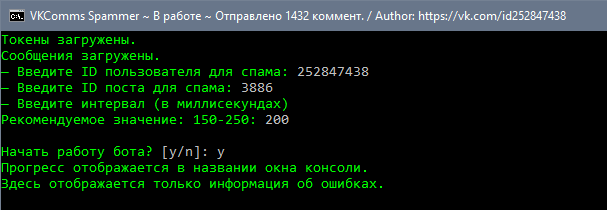

# VKCommsSpammer
Использование: 
— скачать и разархивировать содержимое в отдельную папку 
— в tokens.txt указать токены от ваших групп (1 токен на 1 строчку) 
— в messages.txt указать сообщения, которые вы хотите отправлять (1 сообщение на 1 строчку) 
— запустить файл Install_Packages.bat для установки пакетов 
— запустить файл Start.bat для правильного запуска скрипта 
— указать все необходимые параметры, предлагаемые скриптом 
— наблюдать результат 

